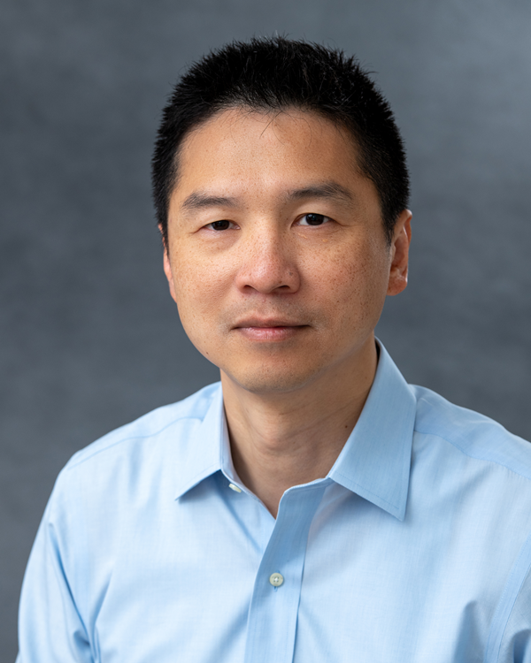

Hao Zhang

Hao Zhang is the founder of Hippocampus Capital Management. 

Prior to founding Hippocampus, Hao was at Two Sigma Investments 2007-2024, and as a Managing Director 2015-2024.

Hao has collaborated with peers and supervised teams on wide-ranging areas in Artificial Intelligence and Machine Learning, especially applied to real-world predictive problems. 
#He is honored and proud of having headed teams of professionals that advanced the state of the art of Artificial Intelligence and Machine Learning methods in financial forecasting domain.

Hao has a PhD in Computer Science, an MA in Statistics, both from UC Berkeley; a BSc from Caltech. He interned at Credit Suisse, Mitsubishi Electric Research Lab, Oracle Corp, NASA JPL, and consulted for Youdao.com (China).

Hao serves on several philanthropic organizations that focus on education and research areas of his alma maters.

张浩

张浩是 Hippocampus Capital Management 的创始人。

在创立 Hippocampus 之前，张浩于 2007 年至 2024 年在 Two Sigma Investments 任职，2015 年至 2024 年担任董事总经理。

张浩与同行广泛合作，并带领团队在人工智能与机器学习的多个方向开展工作，尤重其在现实世界预测问题中的应用。他曾率领专业团队推动了人工智能与机器学习方法在金融预测领域的前沿发展，并对此深感荣幸与自豪。

张浩在加州大学伯克利分校先后获得计算机科学博士和统计学硕士学位，另获加州理工学院学士学位。

他曾在瑞士信贷、三菱电机研究实验室（MERL）、甲骨文公司（Oracle）与美国国家航空航天局喷气推进实验室（NASA JPL）实习，并曾为中国有道公司（Youdao.com）提供咨询。

张浩亦服务于多家慈善机构，重点支持其母校在教育与科研方面的事业。
